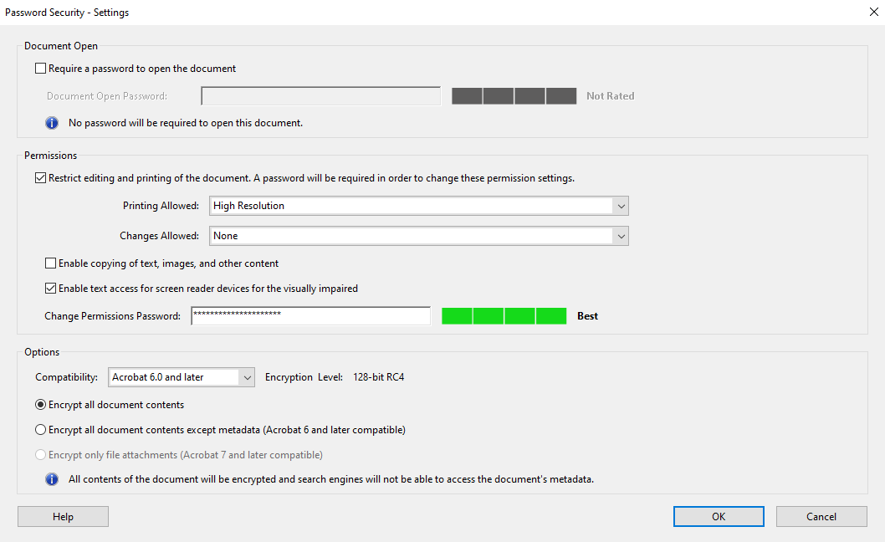

[Version History](https://github.com/CCHMC-Translation/CCHMC-Translation.github.io/commits/master/index.md)

General
=======

Languages Which Use Latin Script
----------------------------------------

1.  Keep the names *Cincinnati Children's, Cincinnati Children's Hospital, Cincinnati Children's Hospital Medical Center,* and *GetWellNetwork* in English.

    1.  If space permits, replace *CCHMC* with *Cincinnati Children's*. Otherwise leave it as *CCHMC*.

2.  On first mention in the body of each document, medication names, departments, department abbreviations, and divisions are translated, followed by the English name in parentheses. Subsequent mentions use the translation only.

3.  Translate campus names, e.g. *Main Campus* and *Liberty Campus*.

    Note that many campus names, e.g. *Burnet* in *Burnet Campus,* *Mason* in *Mason Campus,* *Liberty* in *Liberty Campus,* *College Hill* in *College Hill Campus,* and *Oak* in *Oak Campus,* refer to neighborhoods or streets and therefore should remain as-is.
    {: .notice--info}

4.  When clearly referring to a location, translate *Base* as *Main Campus*.

Languages Which Do Not Use Latin Script
-------------------------------------------------

1. On first mention in the body of each document, medication names, *Cincinnati Children's, Cincinnati Children's Hospital, Cincinnati Children's Hospital Medical Center, GetWellNetwork*, departments, department abbreviations, divisions, building names, names of US states (e.g. Ohio, Kentucky, and Indiana), and campus names are translated, followed by the English name in parentheses. Subsequent mentions use the translation only.

    Note that many campus names, e.g. *Burnet* in *Burnet Campus,* *Mason* in *Mason Campus,* *Liberty* in *Liberty Campus,* *College Hill* in *College Hill Campus,* and *Oak* in *Oak Campus,* refer to neighborhoods or streets and therefore should be transliterated, not translated.
    {: .notice--info}

    2. When clearly referring to a location, translate *Base* as *Main Campus*.

    3. If space permits, replace CCHMC with the translation of Cincinnati Children’s. Otherwise leave it in English.

       Note: If this is the first mention of Cincinnati Children's, also make it bilingual as indicated above.
       {: .notice--info}      

2. Replace letters in ordered lists with appropriate letters.

3.  Location letters (e.g. *D* in *Location D*) remain in English.

    Note: many Cincinnati Children's buildings are named with letters such as *Location D.* Specific floors in those buildings are referred to with the building letter and floor number, e.g. *D2.*
    {: .notice--info}

All Languages
----------------

3.  Addresses in the United States remain in English.

8.  Dates: In English source documents, dates will likely be written month/day/year. In translations, when not limited by space, spell out the month, e.g. *August 7, 2015* instead of *8/7/2015* or *7/8/2015*. Do not write *August/7/2015* or *7/August/2015*. When limited by space, use the ISO 8601 date format: year (four digits), month (two digits) and day (two digits), e.g. *2015-08-07*.

6.  Whenever a form has a signature line labeled *Witness,* make that label and any additional corresponding labels (e.g. *Date)* bilingual.

    Note: witnesses usually only speak English but are often asked to sign translated forms to indicate they were present when the form was signed by a limited English proficient person.
    {: .notice--info}
    
    Exception: In cases where the translation and English label are the same (e.g. *date* in French), the label may remain monolingual.
    {: .notice--warning}

9.  Whenever something isn't clear, or sounds potentially inappropriate when translated, ask for clarification.

13. For book titles in the body of the document where no translation has been published, add a translation of the title in \[brackets\] after the English title. If a translation has been published, just use the title of the translated book.

13. For citations on References pages at the end of documents, keep everything as-is, but add a translation of the title in \[brackets\] after the English title.

14.	Leave sections labeled *For office use only* in English. Make the label *For office use only* bilingual.

15.	Only convert measurements when they are used as approximations in prose, e.g. “ten feet away,” “a couple miles,” “a few pounds,” etc.

17. Except the main Cincinnati Children's page *www.cincinnatichildrens.org*, check all URLs, QR codes, or any other link to see if they are available in the target language. If yes, use the appropriate replacement (URL, QR code, or link) for the target language. If no, add *(only available in English)* after the URL or in the appropriate place in the target sentence. For example, add the translation of *(only available in English)* after *www.cincinnatichildrens.org/experiencesurvey* since that page is not available in any other languages.

	Note: You can get the URL from a QR code at [zxing.org](https://zxing.org).
	{: .notice--info}

19. Do not translate text which is not in the source language, e.g. Arabic text in the source document of an English-to-Spanish translation.

20. Translate "Dr. No PCP" as "[No Primary Care Physician on file]" with "No Primary Care Physician on file" in the target language.

Translations Into English
-------------------------------
For translations into English, add *Translated by Cincinnati Children's* to the footer of the translation, right justified, 8 pt. Arial, regular.

Formatting
============

5.  Ensure no essential elements are closer than one quarter inch to the edge of the page.

7.  Always translate text embedded in images. This may be done by overlaying text boxes or editing the image in Photoshop. When this cannot be done cleanly, contact the project manager for further instructions.

    Exception: Do not translate maps of Cincinnati Children's locations that are embedded images.
    {: .notice--warning}

18. Do not translate Cincinnati Children's letterhead.

21. Use the same fonts as the source file. If a source font does not support the target characters, use Noto Sans (except for Arabic (use *Frutiger Arabic*) and Burmese (use *Zawgyi-One*)).
2.  For **languages which do not use Latin script**:

    1.   Do not use optical kerning in Adobe InDesign, Adobe Illustrator or any other desktop publishing software.

    2.  Replace Microsoft Office form field checkboxes with the Unicode ballot box character: ☐ (U+2610) or ☑ (U+2611).

9. For InDesign and Illustrator files deliver a package containing:

     1. All native typefaces used in the piece (no outlines)

     2. All linked art/photos

     3. An unsecured "High-Quality Print" PDF without crops/bleeds for our visual reference

     4. A "High-Quality Print" PDF without crops/bleeds for our visual reference secured with a unique password and the following settings:
        

     5. An IDML conversion file (InDesign only)

     6. If your design team has any notes, please have them fill out their contact information and anything of note in the "Instructions" file that normally gets generated when the file is packaged out of InDesign.

Specific Document Types
============================

HIM and HIC barcoded documents
-------------------------------------

Note: the barcode in the footer is not usually displayed in Word. Instead, something like *\*DTM1234\** is displayed.
{: .notice--info}

1.  Make the titles bilingual.

2.  Add *THE ENGLISH VERSION OF THIS DOCUMENT IS FOR REFERENCE PURPOSES AND MUST BE INCLUDED IN THE MEDICAL RECORD* above the header on the first page in English only, centered, 8 pt. Times New Roman, regular.

3.  Add the ISO 639-1 Code of the target language and language name in parentheses after the form ID in the left side of the footer, e.g. *J1194-AR (Arabic)* for the Arabic translation of form J1194.

4.  Ensure the HIC date below the form ID matches the source document, even when using a template with a different date.

*Knowing Notes*
------------------

1.  Keep the following elements of footer in English: number (e.g. *KN0123*), copyright notice (e.g. *©2016 Cincinnati Children's Hospital Medical Center*) and revision date (e.g *01/16*).

2.  When the *Knowing Note* is for Home Care, add the title in English to the header of the translation on all pages, right justified (left justified for right-to-left languages), 8 pt. Arial, regular.

    Note: This could be indicated by "Home Care" being included in the logo, or by the words "Home Instructions" appearing above the document title on page 1.
    {: .notice--info}

*Health Topics*
------------------

*Health Topics* usually include *HT* in the file name. If you are unsure if a document is a *Health Topic* or not, ask.

1.	Add *Health Topic: Title - Language* in English to the footer of the translation, right justified (left justified for right-to-left languages), 8 pt. Arial, regular, e.g. *Health Topic: Hearing Loss - Spanish*.

2.	Keep the revision date label exactly as it is written in English, i.e. *Last updated 02/20*.

Patient Calendars
---------------------

1.  When patient calendars contain the patient name and/or MRN in the source, include them in English in the target document.

2.  Make the name of the month bilingual with the English in parentheses.

Documents Containing Protected Health Information (PHI)
--------------------------------------------------------------------

1.  Always transmit documents through secure channels.

2.  PHI is information, including demographic information, which relates to:

    1.  the individual's past, present, or future physical or mental health or condition,

    2.  the provision of health care to the individual, or

    3.  the past, present, or future payment for the provision of health care to the individual, and that identifies the individual or for which there is a reasonable basis to believe can be used to identify the individual. Protected health information includes many common identifiers (e.g., name, address, birth date, Social Security Number) when they can be associated with the health information listed above.

3. Once the translation is completed and delivered to us, remove the PHI from any and all files you retain for record keeping. Ask all vendors contracted for the project to do the same. Specifically, the following identifiers of all our patients, or of relatives, employers, or household members of patients, must be removed[1](#PHI):

   1.  Names

   2.  All geographic subdivisions smaller than a state, including street address, city, county, precinct, ZIP code, and their equivalent geocodes

   3.  All elements of dates (except year) for dates that are directly related to an individual, including birth date, admission date, discharge date, death date, and all ages over 89 and all elements of dates (including year) indicative of such age, except that such ages and elements may be aggregated into a single category of age 90 or older

   4.  Telephone numbers

   5.  Fax numbers

   6.  Email addresses

   7.  Social security numbers

   8.  Medical record numbers

   9.  Health plan beneficiary numbers

   10.  Account numbers

   11.  Certificate/license numbers

   12.  Vehicle identifiers and serial numbers, including license plate numbers

   13.  Device identifiers and serial numbers

   14.  Web Universal Resource Locators (URLs)

   15.  Internet Protocol (IP) addresses

   16.  Biometric identifiers, including finger and voice prints

   17.  Full-face photographs and any comparable images

   18.  Any other unique identifying number, characteristic, or code, except as permitted by 45 C.F.R. 164.514(c).

4. See our business associate agreement for more details on handling PHI.

Specific Languages
==================

At the moment, there are specific style guidelines for the following languages:

Amharic
---------

Translate *Cincinnati Children's Hospital Medical Center* as የሲንሲናቲ የህፃናት ሆስፒታል ህክምና ማዕከል.

Arabic
------

1.  The following terms must be translated as follows:

    Cancer and Blood Diseases Institute
    : ﻣﺮﻛﺰ أﻣﺮاض اﻟﺪم واﻟﺴﺮطﺎن

    Munch & Mingle
    :  ﺟﻠﺴﺔ إﺟﺘﻤﺎﻋﯿّﺔ

    Cincinnati Children's Hospital Medical Center
    : ﻣﺮﻛﺰ ﻣﺴﺘﺸﻔﻰ ﺳﯿﻨﺴﯿﻨﺎﺗﻲ ﻟﻸطﻔﺎل اﻟﻄﺒﻲ

    Cincinnati Children's Hospital
    :  ﻣﺴﺘﺸﻔﻰ ﺳﻨﺴﯿﻨﺎﺗﻲ ﻟﻸطﻔﺎل

    RN
    :  ﻣﻤﺮﺿﺔ ﻣﺠﺎزة

    APRN
    :  ﻣﻤﺮﺿﺔ ﻣﻤﺎرﺳﺔ

    Guest Services
    :  ﻣﻜﺘﺐ اﻟﻀﯿﺎﻓﮫ

    Family Update
    :  ﻧﺸﺮة اﻷﺧﺒﺎر ﻟﮭﺬا اﻷﺳﺒﻮع

    Best Upon Request
    :  اﻷﻓﻀﻞ ﻋﻨﺪ اﻟﻄﻠﺐ

    Destination Excellence
    :  المكتب الدولي

    Family Resource Center
    : مركز موارد العائلة 
 
    Location *(e.g. Location D)*
    :  ﻣﺒﻨﻰ

    concourse
    :  اﻟﺒﺎﺣﺔ اﻟﺮﺋﯿﺴﯿﺔ

    Welcome Center
    : ﻣﺮﻛﺰ اﻻﺳﺘﻘﺒﺎل

    Bowel Management Program
    : برنامج علاج التحكم في الأمعاء

    blood cell
    : كرات كريات

    Day Hospital
    : المستشفى النهاري

    Spiritual and Grief Care Center
    : مركز الخدمات الدينية والمواساة

2.  For times, rather than using only AM (ﺻﺑﺎﺣﺎ) and PM (ًء ﻣﺳﺎ), use ظﮭراً, ﻟﯾﻼً and ﻋﺻرا when appropriate.

3.  Unless instructed otherwise, use Western Arabic (European) numerals instead of Arabic-Indic (Eastern Arabic/Indian) numerals in translations.

4.  When space does not permit translating credentials into Arabic, use the English abbreviations.

8.  When translating the *Cancer Program Family Update*:

    1.  Keep the date range above the Events and Activities list on page 2 in English so staff can easily tell when the document is outdated.

    2.  For this list of doctors at the bottom of page 2, use the female version of the title for females.

9.	When translating from Arabic to English, any Hijri dates should be converted to Gregorian dates followed by the Hijri date in parentheses.

Burmese
--------

1. Translate *Cincinnati Children's Hospital Medical Center* as စင်စီနတီ ကလေးဆေးရုံ ၏ ဆေးပညာစင်တာ သည်.

Chinese (Simplified)
--------------------

1.  Translate *Cincinnati Children's Hospital Medical Center* as 辛辛那提儿童医院医疗中心.

3.  Write language code as ZHS.

Chinese (Traditional)
---------------------

1.  Translate *Cincinnati Children's Hospital Medical Center* as 辛辛那提兒童醫院醫療中心.

3.  Write language code as ZHT.

French
-------

The following terms must be translated as follows:

   email
   : courriel

   fax
   : fax
   
Greek
-------

Translate *Cincinnati Children's Hospital Medical Center* as Ιατρικό Κέντρο του Νοσοκομείου Παίδων του Σινσινάτι.

Gujarati
----------

Translate *Cincinnati Children's Hospital Medical Center* as સિનસિનાટી ચિલ્ડ્રન્સ હૉસ્પિટલ મેડિકલ સેન્ટર.

Hebrew
------

Translate *Cincinnati Children's Hospital Medical Center* as החולים בית של הרפואי המרכז בסינסינטי לילדים.

Hindi
-----

Translate *Cincinnati Children's Hospital Medical Center* as सिनसिनाटी चिल्ड्रन्स हास्पिटल मेडिकल सेंटर.

Italian
------
Use angular quotation marks («\ »), reserving double (“\ ”) quotation marks for nested quotes and single (‘\ ’) quotation marks for twice-nested quotes.

Japanese
----------

Translate *Cincinnati Children's Hospital Medical Center* as シンシナティ小児病院医療センター.

Korean
-------

Translate *Cincinnati Children's Hospital Medical Center* as 신시내티 아동병원 메디컬 센터.

Nepali
------

Translate *Cincinnati Children's Hospital Medical Center* as सिन्सिनाटि बाल अस्पताल मेडिकल सेन्टर.

Punjabi
--------

Translate *Cincinnati Children's Hospital Medical Center* as ਸਿਨਸਿਨਾਟੀ ਬੱਚਿਆਂ ਦਾ ਹਸਪਤਾਲ ਚਿਕਿਤਸਕ ਕੇਂਦਰ.

Russian
-------

Translate *Cincinnati Children's Hospital Medical Center* as Медицинский центр детской больницы Цинциннати.

Spanish
-------

1.  Our electronic medical record system does not support spaces, hyphens or diacritics in names. To account for this:

    1.  Add missing diacritics to common names.

    2.  When it's clear that a surname on a source document is actually a paternal surname and maternal surname joined without a space, separate and capitalize the surnames in the translation, e.g *García Rodríguez* as the translation of *Garciarodriguez.*

2.  The following terms must be translated as follows:

	Concourse
	: Pasillo principal

	Location *(e.g. Location D)*
	: Área

	Emergency Room
	: Sala de Emergencia

	Emergency Department
	: Sala de Emergencia

	Destination Excellence
	: Programa para Pacientes Internacionales

	Child Life Specialist
	: Especialista en Vida Infantil

	Child Life
	: Vida Infantil

	DDBP (Division of Developmental and Behavioral Pediatrics)
	: División de Pediatría del Desarrollo y Comportamiento

	BMCP (Division of Behavioral Medicine and Clinical Psychology)
	: División de Medicina del Comportamiento y Psicología Clinica

	Day Hospital
	: Hospital de Día

	referral
	: remisión

	Center for Breastfeeding Medicine
	: Centro de Medicina de  Lactancia Materna

	Breastfeeding Medicine Clinic
	: Clínica de Medicina de Lactancia Materna
	
	COVID-19
	: el COVID-19
	
	covid, Covid
	: el COVID

    Concierge Services
    : Servicios de Concierge

    Urgent Care
    : Urgencias menores
	
3.	Use *usted* except where the text is clearly addressed to a child. If you think *tú* would be more appropriate, for example in marketing materials, ask if we’d like to make an exception.

4.	Use double (“ ”) and single (‘ ’) quotation marks only, never angular quotation marks (« »).

5.  When times are written in the 12-hour format, use the abbreviations "a. m." and "p. m." 

6.  Translate "nurse" as "enfermero(a)" and "nurses" as "enfermeros" unless the gender is known.

Tigrinya
----------

Translate *Cincinnati Children's Hospital Medical Center* as ሕክምናዊ ማእከል ናይ ሆስፒታል ህጻናት ሲንሲናቲ.

Footnotes
===========
<a name="PHI">1</a>: [45 C.F.R. § 164.514](https://www.govinfo.gov/content/pkg/CFR-2017-title45-vol1/pdf/CFR-2017-title45-vol1-sec164-514.pdf)
